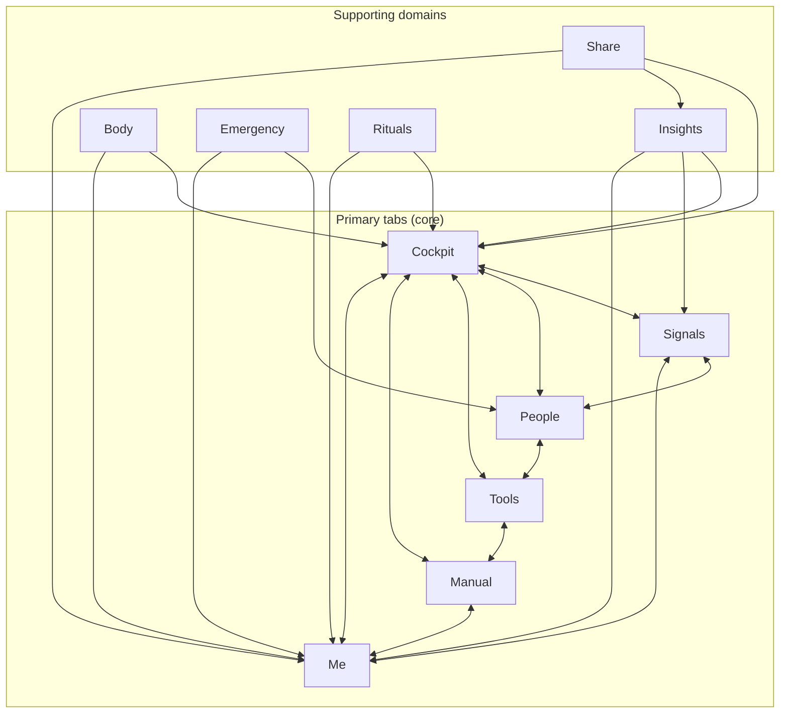

# InGauge Architecture Organization Plan

This document is the **migration and ownership plan** for the app. It complements the [route map](INGAUGE-ROUTE-MAP.md) and [governance matrix](INGAUGE-GOVERNANCE-MATRIX.md): those define *what* each screen does (compliance, AI, data); this doc defines *where* each feature should live and how to get there.

**Main issue:** Route **ownership** — many features are correct but live in the wrong place (e.g. tools as modals, insights scattered). The governance matrix is in good shape; this plan fixes structure.

---

## 1. What the architecture actually is

When product logic is separated from current file layout, the system forms **10 domains**.

### Core product domains (the six primary tabs)

| Domain | Role |
|--------|------|
| **Cockpit** | Home dashboard: gauges, score, quick actions, “how am I doing?” |
| **Signals** | Alerts and attention: drift, birthdays, predictions, “what needs my attention?” |
| **People** | Relationships: circle, Lights, Mind Mail, who matters. |
| **Tools** | Human skills: Decode, Role-play, Reset, decision, repair, etc. |
| **Manual** (Learn) | Education: lessons, 12 Questions, skills, manual. |
| **Me** | Identity and settings: profile, insights, goals, preferences, legal. |

### Supporting domains

| Domain | Role |
|--------|------|
| **Insights** | Pattern views: Patterns, Forecast, Timeline, Flight Log, Wrapped, reports, share. |
| **Body** | Physical: body maintenance, cycle, providers, health connections, Oura. |
| **Emergency** | Crisis and reach-out: breathe, crisis resources, reach-out. |
| **Rituals** | Pre-flight, post-flight, gratitude review. |
| **Share** | Sharing cockpit, snapshots, insight links. |

That is the **system model** the file structure should reflect.

---

## 2. Clean domain structure (target)

Target layout under `app/`:

```
app/
  (auth)/
  (tabs)/
  people/
  tools/
  learn/
  profile/
  insights/
  body/
  emergency/
  rituals/
  share/
  lesson/
  (modals)/
```

Everything in the app fits inside one of these. Move toward this structure incrementally; the KEEP / MOVE / MERGE / REMOVE sheet below is the execution plan.

---

## 2.5 Visual system map

How the 10 domains connect. The six primary tabs form the core; supporting domains plug into them.



**Relationships in words:**

| Connection | Why |
|------------|-----|
| **Cockpit ↔ Signals** | Cockpit shows “how I’m doing”; Signals shows “what needs attention” — same underlying data, different lens. |
| **Cockpit ↔ People** | Gauges include Connection; People tab and check-ins feed that. |
| **Cockpit ↔ Tools** | Cockpit suggests “what to do next”; Tools are the actions. |
| **Cockpit ↔ Manual** | Learning explains gauges and skills; Manual is the education home. |
| **Cockpit ↔ Me** | Score and identity live in Me; Cockpit is the daily view. |
| **Signals ↔ People** | Drift, birthdays, “who needs attention” come from People data. |
| **People ↔ Tools** | Decode, Role-play, reach-out, relationship repair are Tools for relationships. |
| **Tools ↔ Manual** | Tools teach skills; Manual explains the concepts. |
| **Manual ↔ Me** | Progress, goals, identity sit in Me; learning is part of profile. |
| **Me ↔ Signals** | Insights and patterns in Me; Signals are the live alerts. |
| **Insights → Cockpit, Signals, Me** | Patterns, Forecast, Timeline, Wrapped, reports feed the dashboard, alerts, and profile. |
| **Body → Cockpit, Me** | Body maintenance and wearables feed Body gauge (Cockpit) and health in Me. |
| **Emergency → People, Me** | Reach-out uses People; crisis resources and settings in Me. |
| **Rituals → Cockpit, Me** | Pre/Post-flight feed gauges and daily flow; ritual history in Me. |
| **Share → Cockpit, Insights, Me** | Share cockpit, snapshots, insight links from Cockpit/Insights; share settings in Me. |

**ASCII fallback** (if Mermaid doesn’t render):

```
                    ┌─────────┐
                    │ Cockpit │
                    └────┬────┘
         ┌───────────────┼───────────────┐
         ▼               ▼               ▼
    ┌─────────┐     ┌─────────┐     ┌─────────┐
    │ Signals │◄───►│ People  │◄───►│  Tools  │
    └────┬────┘     └────┬────┘     └────┬────┘
         │               │               │
         └───────────────┼───────────────┘
                         ▼
                    ┌─────────┐     ┌─────────┐
                    │ Manual  │◄───►│   Me    │
                    └─────────┘     └────┬────┘
                         ▲               ▲
         ┌───────────────┼───────────────┼───────────────┐
         │               │               │               │
    Insights         Body          Emergency        Rituals
         │               │               │               │
         └───────────────┴───────────────┴───────────────┘
                                    Share
```

---

## 3. KEEP / MOVE / MERGE / REMOVE

Use this as the checklist for devs and Cursor. Each item is either already correct, needs to move, should be merged with something else, or should be removed/deprecated.

### KEEP (correctly placed)

Already in the right domain. No file moves required.

| Domain | Routes | Notes |
|--------|--------|-------|
| **Tabs** | `/(tabs)`, `/(tabs)/signals`, `/(tabs)/people`, `/(tabs)/tools`, `/(tabs)/learn`, `/(tabs)/me` | Six primary tabs. |
| **Learning** | `/lesson/[id]`, `/learn/*` | Lesson and learn stack. |
| **Tools** | `/tools/quick-reset`, `/tools/decision`, `/tools/focus`, `/tools/creativity`, `/tools/bias-check`, `/tools/win-capture`, `/tools/life-direction-finder`, `/tools/family-conflict`, `/tools/human-roles`, `/tools/parent-compass`, `/tools/memory-builder`, `/tools/relationship-repair`, `/tools/perspective-translator` | Tool stacks already under `tools/`. |
| **Emergency** | `/emergency`, `/emergency/reach-out`, `/emergency/breathe`, `/emergency/crisis` | Emergency stack. |
| **Rituals** | `/rituals/pre-flight`, `/rituals/post-flight`, `/rituals/gratitude-review` | Rituals stack. |
| **Share** | `/share/cockpit` | Share entry. |
| **Auth** | `/(auth)/*` | Sign-in, sign-up, forgot password. |

---

### MOVE (to new domains)

Feature is correct; it just lives in the wrong place. Move when refactoring.

#### Move to **Insights**

| Current route(s) | Future home under `insights/` |
|------------------|-------------------------------|
| `/patterns` | `insights/patterns/` |
| `/forecast` | `insights/forecast/` |
| `/timeline` | `insights/timeline/` |
| `/wrapped` | `insights/wrapped/` |
| `/flight-log/*` | `insights/flight-log/` |
| `/insight/[code]` | `insights/share/` or `insights/insight/[code]` |
| `/(modals)/weekly-insight` | `insights/weekly/` or modal launcher |
| `/(modals)/sovereignty-report` | `insights/reports/` |
| `/(modals)/therapist-share` | `insights/reports/` or `insights/share/` |
| `/(modals)/share-snapshot` | `insights/share/` |

**Target structure:**

```
insights/
  patterns/
  forecast/
  timeline/
  flight-log/
  wrapped/
  reports/
  share/
```

#### Move to **People**

| Current route(s) | Future home under `people/` |
|------------------|-----------------------------|
| `/mind-mail/*` | `people/mind-mail/` |
| `/lights/*` | `people/lights/` |
| `/love/*` | `people/love/` |
| `/love-history/*` | `people/love/history/` (or merge with love per MERGE below) |

**Target structure:**

```
people/
  lights/
  mind-mail/
  love/
    datesume
    history
    insights
```

#### Move to **Profile** (Me)

| Current route(s) | Future home under `profile/` |
|------------------|------------------------------|
| `/habits/*` | `profile/habits/` |
| `/your-story/*` | `profile/your-story/` |
| `/(modals)/identity-setup` | `profile/identity/` or keep as modal launcher |
| `/(modals)/foundation-*` | `profile/foundation/` |
| `/(modals)/settings` | `profile/settings/` |

**Target structure:**

```
profile/
  habits/
  your-story/
  foundation/
  settings/
```

#### Move to **Body**

| Current route(s) | Future home under `body/` |
|------------------|----------------------------|
| `/body-maintenance/*` | `body/maintenance/` |
| `/(modals)/body-maintenance` | Quick log → modal or `body/maintenance/quick` |
| `/(modals)/body-maintenance-edit` | `body/maintenance/` |
| `/(modals)/cycle` | `body/cycle/` |
| `/(modals)/health-connections` | `body/health-connections/` |
| `/(modals)/oura-connect` | `body/oura/` |

**Target structure:**

```
body/
  maintenance/
  cycle/
  providers/
  health-connections/
  oura/
```

#### Move to **Tools** (modals → tool stacks)

These are full tools that currently live as modals. They should become real routes under `tools/`.

| Current route | Future home |
|---------------|-------------|
| `/(modals)/decode` | `tools/decode/` |
| `/(modals)/resolve` | `tools/resolve/` |
| `/(modals)/role-play` | `tools/role-play/` |
| `/(modals)/replay` | `tools/replay/` |
| `/(modals)/relate` | `tools/relate/` |
| `/(modals)/referee` | `tools/referee/` |
| `/(modals)/reach-out-scaffold` | `tools/reach-out/` |
| `/(modals)/critical-thinking` | `tools/critical-thinking/` |
| `/(modals)/help-someone` | `tools/help-someone/` |
| `/(modals)/prompt-generator` | `tools/prompt-generator/` |

**Target:** `tools/<name>/` for each; modals can remain as **launchers** that push the user into the tool stack if desired.

#### Move to **Learn**

Educational modals should become lessons or learn sub-routes.

| Current route | Future home |
|---------------|-------------|
| `/(modals)/love` | `learn/relationship-toolkit/` or lesson |
| `/(modals)/attraction` | `learn/psychology/` or lesson |
| `/(modals)/attachment-style` | `learn/psychology/` or lesson |
| `/(modals)/boundaries` | `learn/relationship-toolkit/` |
| `/(modals)/difficult-people` | `learn/relationship-toolkit/` |
| `/(modals)/red-green-flags` | `learn/relationship-toolkit/` |
| `/(modals)/learning-style-quiz` | `learn/` or profile |

**Target:** `learn/relationship-toolkit/`, `learn/psychology/`, or discrete lessons under `/lesson/[id]`.

---

### MERGE (deduplicate)

Two or more routes represent the same concept or one should be the launcher for the other.

| Concept | Current state | Solution |
|---------|---------------|----------|
| **Quick reset** | `(modals)/quick-reset` + `/tools/quick-reset` | Modal = launcher; `tools/quick-reset` = real home. |
| **Talk vs Ask Gauge** | `/(tabs)/talk` + `/(modals)/ask-gauge` | Keep both: Talk = full AI conversation; Ask Gauge = contextual shortcut. |
| **Body maintenance** | `(modals)/body-maintenance` + `/body-maintenance/*` | Modal = quick log; `body/maintenance` = full system. |
| **Love + Love history** | `/love/*` + `/love-history/*` | Merge under `people/love/`: datesume, history, insights. |

---

### REMOVE / DEPRECATE

Legacy or placeholder; do not build on these.

| Route | Action |
|-------|--------|
| `(modals)/onboarding-old` | Mark deprecated; remove when safe. |
| `(modals)/features` | Mark deprecated; remove or replace with real feature list. |

---

## 4. Modal discipline rule

Add this to route and feature decisions:

**Modal rule**

A screen should remain in `(modals)` **only if** it:

- takes under ~60 seconds to complete,
- has minimal branching,
- does not store complex or domain-specific data,
- and is **not** a core feature (core features get real routes).

Everything else should be a **real route** under the appropriate domain (e.g. `tools/decode/`, `insights/patterns/`, `body/maintenance/`). Modals can act as **launchers** that navigate into those routes.

This rule is also recorded in the [route map](INGAUGE-ROUTE-MAP.md) (section 5).

---

## 5. Final architecture vision

The target system is:

| # | Domain | Ownership |
|---|--------|-----------|
| 1 | **Cockpit** | Home, gauges, score, quick actions. |
| 2 | **Signals** | Alerts, drift, attention. |
| 3 | **People** | Circle, Lights, Mind Mail, Love, relationships. |
| 4 | **Tools** | All human-skill tools (Decode, Role-play, Reset, etc.). |
| 5 | **Manual** (Learn) | Lessons, 12 Questions, skills, relationship/psychology toolkit. |
| 6 | **Me** | Profile, identity, habits, your-story, settings. |
| 7 | **Insights** | Patterns, Forecast, Timeline, Flight Log, Wrapped, reports, share. |
| 8 | **Body** | Maintenance, cycle, health connections, Oura. |
| 9 | **Emergency** | Crisis resources, reach-out, breathe. |
| 10 | **Rituals** | Pre-flight, post-flight, gratitude. |
| — | **Share** | Sharing (cockpit, snapshot, insight links). |

Each domain has **clear ownership**. New features should be placed in the correct domain from the start.

---

## 6. The most important insight

**The app is not a collection of tools. It is a Human Navigation System.**

The architecture should reflect:

- **Awareness** — Cockpit, Signals, Insights (Patterns, Timeline, Wrapped).
- **Relationships** — People (Lights, Mind Mail, Love).
- **Action** — Tools, Emergency, Rituals.
- **Learning** — Manual (Learn), lessons.
- **Identity** — Me (profile, your-story, settings).
- **History** — Flight Log, Timeline, Wrapped, love history.

Once routes match these concepts, the whole app is easier to maintain and the AI Brain can reason over a coherent [Data Graph](INGAUGE-DATA-GRAPH.md) and [route map](INGAUGE-ROUTE-MAP.md).

---

## 7. Document relationships

| Document | Role |
|----------|------|
| **INGAUGE-ARCHITECTURE-ORGANIZATION.md** (this doc) | Domain structure, KEEP/MOVE/MERGE/REMOVE, modal rule, target layout. |
| **INGAUGE-ROUTE-MAP.md** | Route list, file tree, modal rule, domain ownership. |
| **INGAUGE-GOVERNANCE-MATRIX.md** | Per-route matrix, AI/voice/safety rules, analytics. |
| **INGAUGE-DATA-POLICY.md** | Data class, retention, permissions (GDPR/CCPA). |
| **INGAUGE-AI-ARCHITECTURE.md** | Five layers, 12 signals, how the Brain uses the graph. |
| **INGAUGE-SYSTEM-MAP.md** | Product blueprint: 10 domains, system map. |
| **INGAUGE-DATA-GRAPH.md** | Nodes, edges, how surfaces and Brain use the graph. |

---

*Next optional step: a visual system map showing Cockpit ↔ Signals ↔ People ↔ Tools ↔ Manual ↔ Me and how Insights, Body, Rituals, and Emergency connect.*
