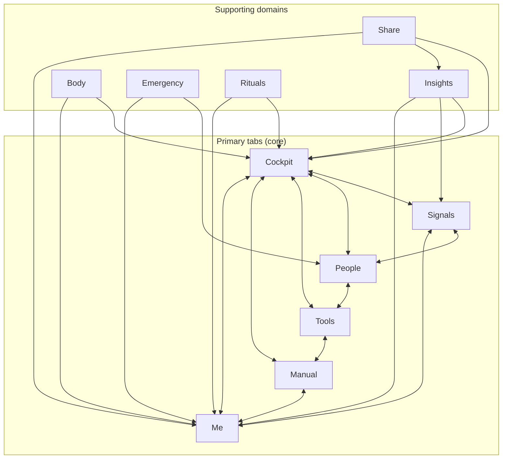

# InGauge System Map

Product blueprint: how the app works conceptually and how the **10 domains** connect. Useful for investors, designers, new engineers, and future you.

**See also:** [README.md](./README.md) · [INGAUGE-ROUTE-MAP.md](./INGAUGE-ROUTE-MAP.md) · [INGAUGE-GOVERNANCE-MATRIX.md](./INGAUGE-GOVERNANCE-MATRIX.md) · [INGAUGE-AI-ARCHITECTURE.md](./INGAUGE-AI-ARCHITECTURE.md) · [INGAUGE-DATA-POLICY.md](./INGAUGE-DATA-POLICY.md)

**Domain ownership, target file layout, and the KEEP/MOVE/MERGE/REMOVE migration checklist** are in [INGAUGE-ARCHITECTURE-ORGANIZATION.md](./INGAUGE-ARCHITECTURE-ORGANIZATION.md).

---

## 1. What the architecture actually is

When product logic is separated from current file layout, the system forms **10 domains**.

### Core product domains (the six primary tabs)

| Domain | Role |
|--------|------|
| **Cockpit** | Home dashboard: gauges, score, quick actions, "how am I doing?" |
| **Signals** | Alerts and attention: drift, birthdays, predictions, "what needs my attention?" |
| **People** | Relationships: circle, Lights, Mind Mail, who matters. |
| **Tools** | Human skills: Decode, Role-play, Reset, decision, repair, etc. |
| **Manual** (Learn) | Education: lessons, 12 Questions, skills, manual. |
| **Me** | Identity and settings: profile, insights, goals, preferences, legal. |

### Supporting domains

| Domain | Role |
|--------|------|
| **Insights** | Pattern views: Patterns, Forecast, Timeline, Flight Log, Wrapped, reports, share. |
| **Body** | Physical: body maintenance, cycle, providers, health connections, Oura. |
| **Emergency** | Crisis and reach-out: breathe, crisis resources, reach-out. |
| **Rituals** | Pre-flight, post-flight, gratitude review. |
| **Share** | Sharing cockpit, snapshots, insight links. |

That is the **system model** the file structure should reflect.

---

## 2. Clean domain structure (target)

Target layout under `app/`:

```
app/
  (auth)/
  (tabs)/
  people/
  tools/
  learn/
  profile/
  insights/
  body/
  emergency/
  rituals/
  share/
  lesson/
  (modals)/
```

Everything in the app fits inside one of these. Move toward this structure incrementally; the full **KEEP / MOVE / MERGE / REMOVE** execution plan is in [INGAUGE-ARCHITECTURE-ORGANIZATION.md](./INGAUGE-ARCHITECTURE-ORGANIZATION.md).

---

## 3. Visual system map

How the 10 domains connect. The six primary tabs form the core; supporting domains plug into them.



### Relationships in words

| Connection | Why |
|------------|-----|
| **Cockpit ↔ Signals** | Cockpit shows "how I'm doing"; Signals shows "what needs attention" — same underlying data, different lens. |
| **Cockpit ↔ People** | Gauges include Connection; People tab and check-ins feed that. |
| **Cockpit ↔ Tools** | Cockpit suggests "what to do next"; Tools are the actions. |
| **Cockpit ↔ Manual** | Learning explains gauges and skills; Manual is the education home. |
| **Cockpit ↔ Me** | Score and identity live in Me; Cockpit is the daily view. |
| **Signals ↔ People** | Drift, birthdays, "who needs attention" come from People data. |
| **People ↔ Tools** | Decode, Role-play, reach-out, relationship repair are Tools for relationships. |
| **Tools ↔ Manual** | Tools teach skills; Manual explains the concepts. |
| **Manual ↔ Me** | Progress, goals, identity sit in Me; learning is part of profile. |
| **Me ↔ Signals** | Insights and patterns in Me; Signals are the live alerts. |
| **Insights → Cockpit, Signals, Me** | Patterns, Forecast, Timeline, Wrapped, reports feed the dashboard, alerts, and profile. |
| **Body → Cockpit, Me** | Body maintenance and wearables feed Body gauge (Cockpit) and health in Me. |
| **Emergency → People, Me** | Reach-out uses People; crisis resources and settings in Me. |
| **Rituals → Cockpit, Me** | Pre/Post-flight feed gauges and daily flow; ritual history in Me. |
| **Share → Cockpit, Insights, Me** | Share cockpit, snapshots, insight links from Cockpit/Insights; share settings in Me. |

### ASCII fallback (if Mermaid doesn't render)

```
                    ┌─────────┐
                    │ Cockpit │
                    └────┬────┘
         ┌───────────────┼───────────────┐
         ▼               ▼               ▼
    ┌─────────┐     ┌─────────┐     ┌─────────┐
    │ Signals │◄───►│ People  │◄───►│  Tools  │
    └────┬────┘     └────┬────┘     └────┬────┘
         │               │               │
         └───────────────┼───────────────┘
                         ▼
                    ┌─────────┐     ┌─────────┐
                    │ Manual  │◄───►│   Me    │
                    └─────────┘     └────┬────┘
                         ▲               ▲
         ┌───────────────┼───────────────┼───────────────┐
         │               │               │               │
    Insights         Body          Emergency        Rituals
         │               │               │               │
         └───────────────┴───────────────┴───────────────┘
                                    Share
```

---

## 4. Final architecture vision

The target system is:

| # | Domain | Ownership |
|---|--------|-----------|
| 1 | **Cockpit** | Home, gauges, score, quick actions. |
| 2 | **Signals** | Alerts, drift, attention. |
| 3 | **People** | Circle, Lights, Mind Mail, Love, relationships. |
| 4 | **Tools** | All human-skill tools (Decode, Role-play, Reset, etc.). |
| 5 | **Manual** (Learn) | Lessons, 12 Questions, skills, relationship/psychology toolkit. |
| 6 | **Me** | Profile, identity, habits, your-story, settings. |
| 7 | **Insights** | Patterns, Forecast, Timeline, Flight Log, Wrapped, reports, share. |
| 8 | **Body** | Maintenance, cycle, health connections, Oura. |
| 9 | **Emergency** | Crisis resources, reach-out, breathe. |
| 10 | **Rituals** | Pre-flight, post-flight, gratitude. |
| — | **Share** | Sharing (cockpit, snapshot, insight links). |

Each domain has **clear ownership**. New features should be placed in the correct domain from the start.

---

## 5. The most important insight

**The app is not a collection of tools. It is a Human Navigation System.**

The architecture should reflect:

- **Awareness** — Cockpit, Signals, Insights (Patterns, Timeline, Wrapped).
- **Relationships** — People (Lights, Mind Mail, Love).
- **Action** — Tools, Emergency, Rituals.
- **Learning** — Manual (Learn), lessons.
- **Identity** — Me (profile, your-story, settings).
- **History** — Flight Log, Timeline, Wrapped, love history.

Once routes match these concepts, the whole app is easier to maintain and the AI Brain can reason over a coherent [Data Graph](./INGAUGE-DATA-GRAPH.md) and [route map](./INGAUGE-ROUTE-MAP.md).

---

For the **migration checklist** (which routes to KEEP, MOVE, MERGE, or REMOVE), see [INGAUGE-ARCHITECTURE-ORGANIZATION.md](./INGAUGE-ARCHITECTURE-ORGANIZATION.md).
